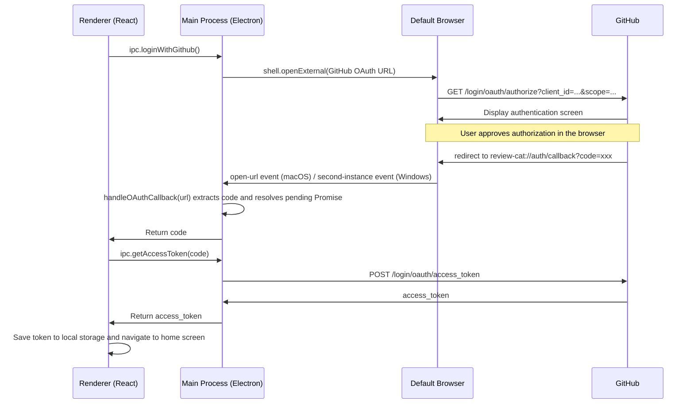

# Authentication Flow

## Overview

ReviewCat uses GitHub OAuth 2.0 for user authentication.
The authentication screen opens in the user's default browser (Chrome, Safari, Firefox, etc.) configured in the host OS, rather than inside an in-app window.

## Custom Protocol

ReviewCat uses the `review-cat://` custom protocol as the GitHub OAuth callback URL.
Electron registers the app as the default handler for this protocol via `app.setAsDefaultProtocolClient('review-cat')`.

- Callback URL: `review-cat://auth/callback`
- This URL must be registered in the GitHub OAuth App's **Authorization callback URL** settings.

## Authentication Flow



## Implementation Details

### Protocol Handler Registration (`packages/main/src/app.ts`)

The custom protocol is registered with the OS before `app.whenReady()`.
During development (`process.defaultApp` is true), the executable path must be passed explicitly.

```ts
if (process.defaultApp) {
  if (process.argv.length >= 2) {
    app.setAsDefaultProtocolClient('review-cat', process.execPath, [
      path.resolve(process.argv[1]),
    ]);
  }
} else {
  app.setAsDefaultProtocolClient('review-cat');
}
```

### Receiving the Callback (`packages/main/src/app.ts`)

The way the protocol callback is received differs between macOS and Windows.

**macOS**: Received via the `open-url` event.

```ts
app.on('open-url', (event, url) => {
  event.preventDefault();
  auth.handleOAuthCallback(url);
});
```

**Windows**: Since a custom protocol triggers a new process launch, a single-instance lock is acquired and the callback is received via the `second-instance` event.

```ts
const gotTheLock = app.requestSingleInstanceLock();
if (!gotTheLock) {
  app.quit();
} else {
  app.on('second-instance', (_event, commandLine) => {
    const url = commandLine.find((arg) => arg.startsWith('review-cat://'));
    if (url) auth.handleOAuthCallback(url);
  });
}
```

### Async Callback Waiting (`packages/main/src/lib/auth.ts`)

`loginWithGithub()` opens the browser and returns a Promise that waits until the user completes authentication.
The `pendingResolve` / `pendingReject` callbacks are held in module-level variables and resolved when `handleOAuthCallback()` is called.

```ts
let pendingResolve: ((code: string) => void) | null = null;
let pendingReject: ((err: Error) => void) | null = null;

export const loginWithGithub = (oAuthOptions: OAuthOptions): Promise<string> => {
  const oAuthUrl = `https://github.com/login/oauth/authorize?...`;
  shell.openExternal(oAuthUrl);

  return new Promise<string>((resolve, reject) => {
    pendingResolve = resolve;
    pendingReject = reject;
  });
};

export const handleOAuthCallback = (url: string): void => {
  const { code, error } = parseOAuthUrl(url);
  if (code && pendingResolve) pendingResolve(code);
  else if (error && pendingReject) pendingReject(new Error(error));
  pendingResolve = null;
  pendingReject = null;
};
```

## GitHub OAuth App Configuration

The following must be configured in the GitHub OAuth App settings.

| Setting | Value |
| --- | --- |
| Authorization callback URL | `review-cat://auth/callback` |
| Required scopes | `repo`, `read:org` |
